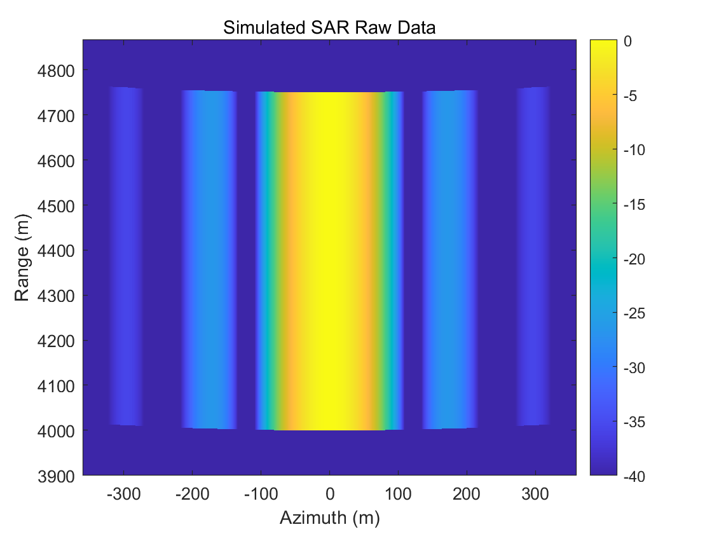
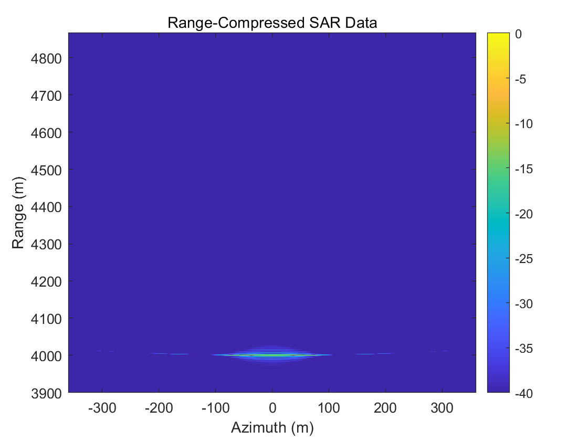
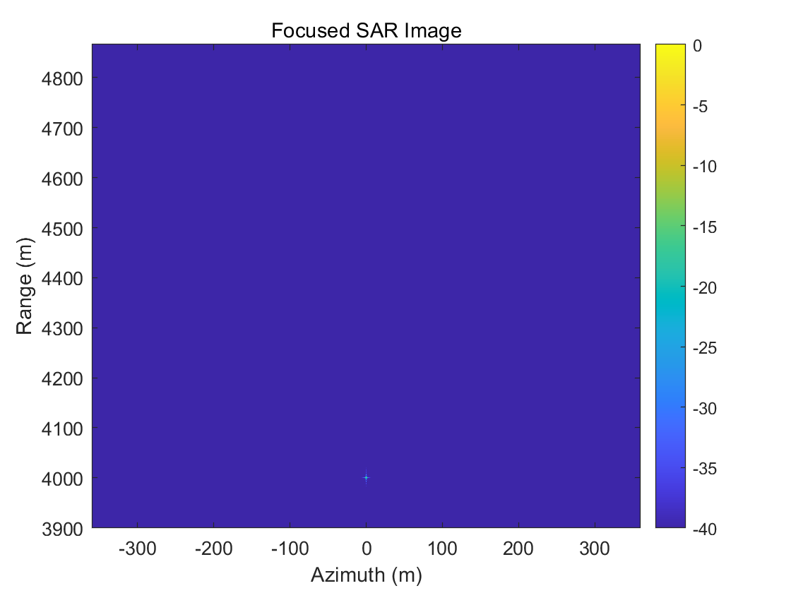

# SAR Raw Data Simulation and Focusing in MATLAB

This project demonstrates a simplified Synthetic Aperture Radar (SAR) processing chain in MATLAB. It includes SAR raw data simulation for a point target, range compression, azimuth compression, and focused SAR image generation. The project also includes processing of provided radar datasets to validate the implemented imaging pipeline.

The implementation was created as a personal radar signal processing practice project based on concepts learned in academic coursework and independently reorganized into a standalone demonstration.

## Overview

This project was developed to understand the basic SAR imaging process, including radar geometry, raw data generation, range compression, azimuth compression, and image formation.

## Features

- SAR raw data simulation for a point target
- Range compression using FFT-based matched filtering
- Azimuth compression for SAR focusing
- Visualization of intermediate and final SAR images
- Processing of provided radar datasets

## Processing Chain

Raw data simulation -> Range compression -> Azimuth compression -> Focused SAR image

## Example Results

  
  
  

  From left to right: simulated SAR raw data, range-compressed data, and final focused SAR image.

## Files

- README.md
- sar_raw_data_simulation_demo.m
- sar_focusing_simulated_data_demo.m
- sar_focusing_dataset_demo.m
- generate_rect_window.m

## Requirements

- MATLAB

## How to Run

1. Open MATLAB.
2. Open the project folder.
3. Run `sar_raw_data_simulation_demo` to generate simulated SAR raw data.
4. Run `sar_focusing_simulated_data_demo` to perform range and azimuth compression on the simulated data.
5. Run `sar_focusing_dataset_demo` to process an external SAR dataset if available.

## Important Note

If an external dataset such as `data.mat` is used, it is not included in this repository by default.

## Notes

This repository is intended as a compact educational and portfolio-style implementation of SAR raw data simulation and focusing concepts.

Possible extensions:
- process multiple point targets
- include range cell migration correction
- compare focused images for different radar parameters
